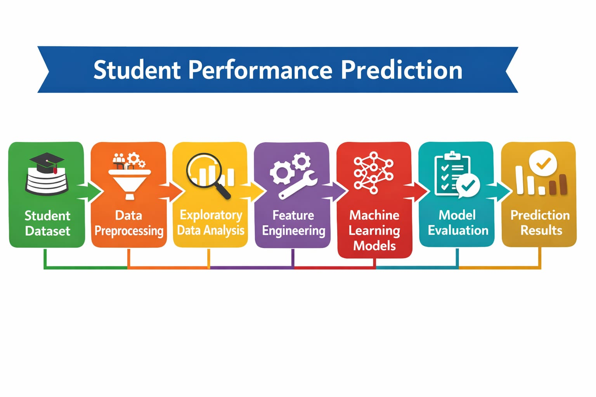
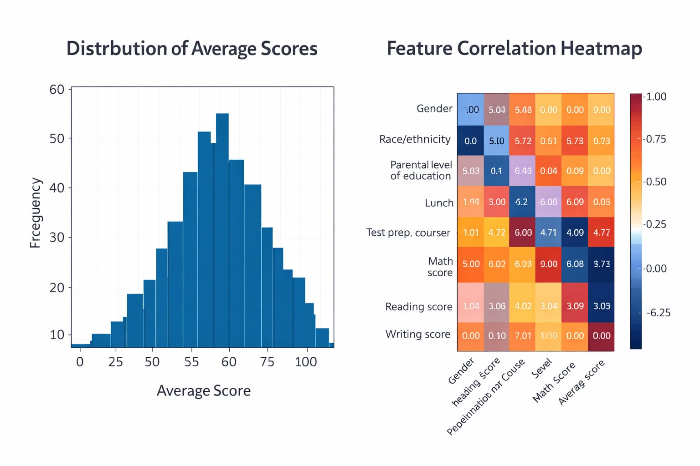

## Project overview diagram 

# Student Performance Prediction 
This project predicts whether a student will pass or fail based on academic performance such as Math Score, Reading Score, and Writing Score along with demographic features.
The goal is to analyze student data and identify the key factors that influence academic success using machine learning models.
## Project Overview
Student performance prediction is an important task in education analytics. By analyzing academic scores and student-related features, we can identify patterns that influence student success.
In this project, machine learning algorithms are used to predict student performance based on different factors such as gender, parental education, lunch type, and test preparation course.
## Dataset
Dataset used: Student Performance Dataset
## Features Included

- Gender  
- Race/Ethnicity  
- Parental Level of Education  
- Lunch Type  
- Test Preparation Course  
- Math Score  
- Reading Score  
- Writing Score
## Machine Learning Workflow

1. Import Libraries  
2. Load Dataset  
3. Dataset Exploration  
4. Feature Engineering  
5. Label Encoding  
6. Exploratory Data Analysis  
7. Train-Test Split  
8. Logistic Regression Model  
9. Random Forest Model  
10. Model Evaluation
# Exploratory Data Analysis

## Distribution of Math Scores
This histogram shows the distribution of Math score among students and helps understand the performance trend.
## Feature Correlation Heatmap
This heatmap shows the correlation between different features such as Math, Reading, and Writing scores.

# Model Training
Two machine learning models were used in this project:
1-Logistic Regression – a baseline classification model.
2-Random Forest Classifier – an ensemble learning model that usually performs better for classification problems.
# Model Evaluation
## Confusion Matrix
The following metrics were used to evaluate the models:
- Accuracy Score
- Confusion Matrix
# Results
After training both models, the Random Forest model performed better than Logistic Regression in predicting student performance.
Important factors affecting prediction:
•Math Score
•Reading Score
•Writing Score
## Technologies Used

- Python  
- Pandas  
- NumPy  
- Matplotlib  
- Seaborn  
- Scikit-learn  
- Jupyter Notebook
## Project Structure
Student-Performance-Prediction
│
├── data
│   └── StudentsPerformance.csv
│
├── notebook
│   └── student_performance.ipynb
│
├── images
│   ├── project_overview_diagram.png
│   ├── distribution_of_math_scores.png
│   ├── feature_correlation_heatmap.png
│   └── confusion_matrix.png
│
└── README.md
# How to Run the Project
## Clone the repository
git clone https://github.com/ananyashuklaa2666-cell/Student-performance-prediction-.git
## Install required libraries
pip install pandas numpy matplotlib seaborn scikit-learn
## Open the notebook
jupyter notebook notebook/student_performance.ipynb
